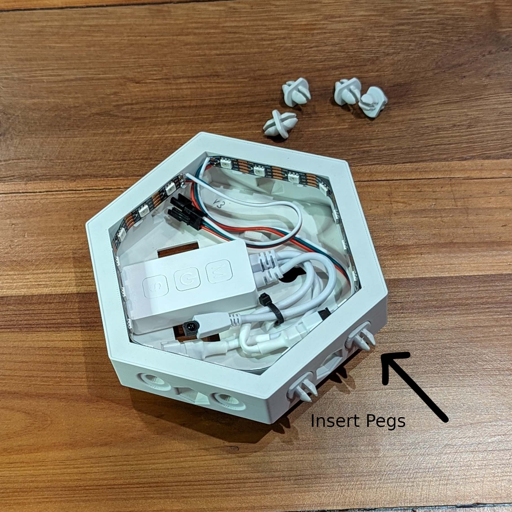

# Light Pod Instructions

## Connecting pods together

### The Rules!

For the most part pods can be connected together on any sides but there are a couple of simple rules to keep in mind.

- Keep pods oriented "up". The wall mount screw "key holes" should face skinny end up and the square 3m Command Strip pull tab holes should be down.

  [ {: width="350" } ](this_side_up.png)

- Pods are wired up in sequence. Starting with the controller pod plug the free end of the led strip into the next pod.  Splitters and Extensions can be purchased to create branches in larger installations.

  [ {: height="350" } ](three_pods_in_a_row_flow.png) [ {: height="350" } ](three_pods_cluster_flow.png)

### Pods in a line

- Starting with the controller pod, use 2 of the double-sided connection pegs to link pods together. Pods can be connected on any sides.

  Remember to leave the bottom of the controller pod open so you can connect power.

  [ {: width="350" } ](control_pod_with_pegs.png)

- Insert pegs into either pod and squeeze together.

  [ {: width="350" } ](two_pods_partial_connection_squeeze.png)

- Feed either male or female connector through the hole and wire pods together. Push connectors until they click.

  (Optional) Use the provided zip ties and built in loops to tidy up the wires.

  [ {: width="350" } ](two_pods_wire_connection.png)

### Pods in a cluster

## Mounting pods to a wall

- Use the included 3m Command Strips to stick pods to a wall.
- Use included drywall anchors and screws.
- Use the mounting key holes and provide your own appropriate anchors for brick, masonry, tile, steel or other wall materials.

### Command Strips

The included 3m Command Strips can be used for a removable installation on flat clean wall surfaces.

**Installation**

- Install Command Strips on the pods.  Only one strip per pod is necessary on either left or right sides. In large installations one strip per 3 pods is recommended.

- Peel the Red side sticker and place the strip so the removal tab lines up with one of the square holes on the back. Use your fingers to firmly rub the strip and make sure its attached to the pod.

- Peel the black side sticker.

- Use a level to align the pods on the wall and when ready, firmly press the pods over the strips and stick to the wall.

**Removal**

With patience command strips can be removed without damaging the wall. Patience is the key.

- Hold the pod steady against the wall while pulling straight down on the removal tabs. Use steady pressure until the command strip releases.

### Drywall Anchors

- Assemble your pod structure on the ground or table.

- Take the assembled pod structure and align it with a level on the wall.  Mark out a couple of the screw keyholes on various ends of the pod structure.  Not every pod will need a screw and anchor.  One screw every 3 pods should be sufficient.

- Set down your pods and take a drill with a #2 philips bit. Use the bit to set the self-tapping plastic drywall anchors into the wall.

- If you hit a stud, you can just use the provided screw without the anchor.

- Screw in the provided screws into the anchors leaving enough room to side the pods onto the screw.

- Mount your pods on the screws.

- Tighten screws to secure the pods to the wall.  If you are using a power drill be careful not to over tighten the screws.
